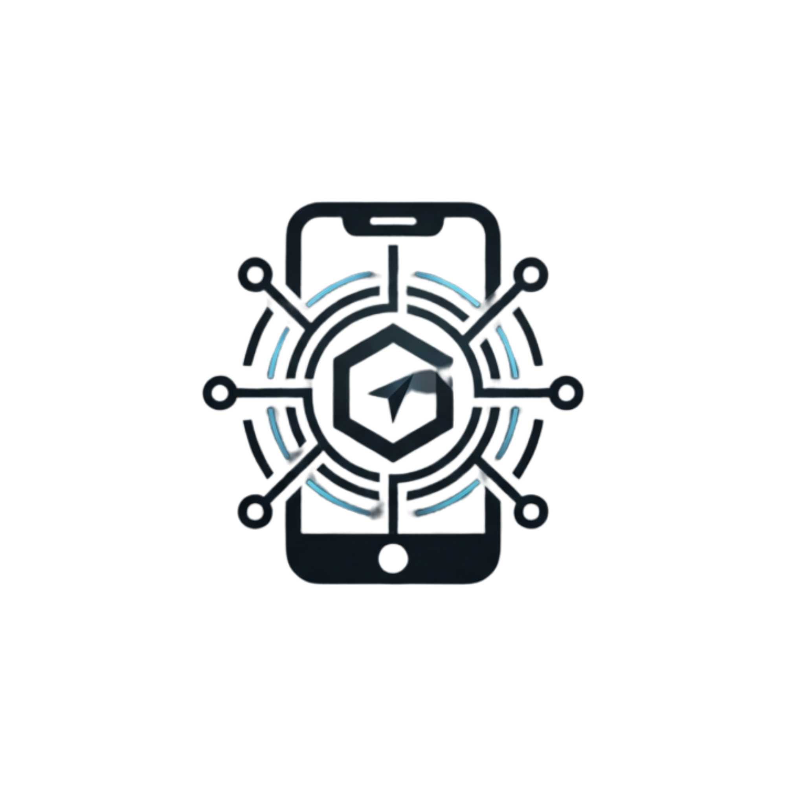
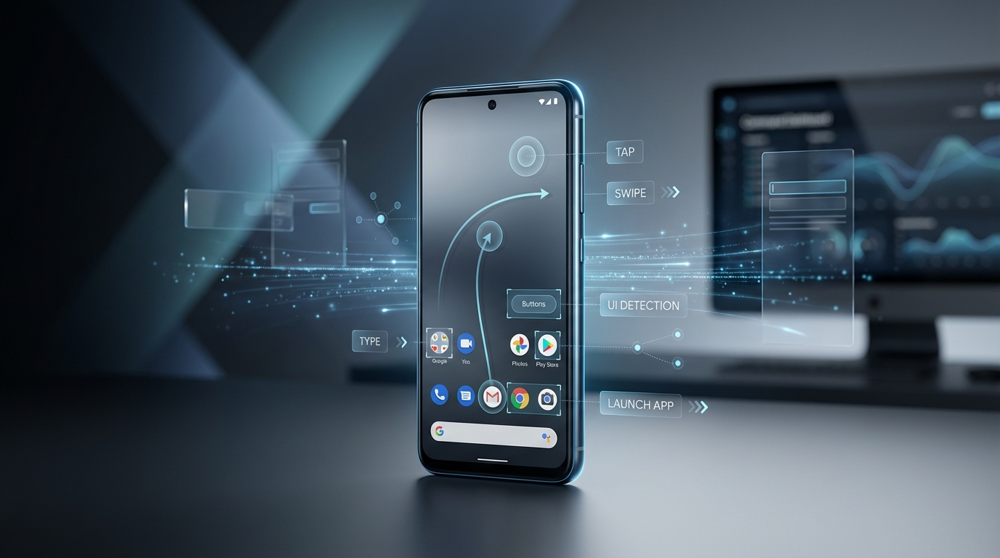

<div align="center">



<h1>CoPhoneMcp</h1>

**Accessibility-first MCP bridge for controlling real Android devices**

Connect AI agents to Android phones over WebSocket, inspect the live UI semantically, and execute guarded actions such as tap, swipe, type, app launch, and navigation.

[](#why-cophonemcp)
[](#architecture)
[](#getting-started)
[](#architecture)
[](#safety-model)
[](#development)

</div>

<div align="center">
  
</div>

## Table of Contents

- [Why CoPhoneMcp](#why-cophonemcp)
- [Features](#features)
- [Architecture](#architecture)
- [Getting Started](#getting-started)
- [Android Bridge Setup](#android-bridge-setup)
- [Tool Surface](#tool-surface)
- [Safety Model](#safety-model)
- [Development](#development)
- [Roadmap](#roadmap)
- [License](#license)

## Why CoPhoneMcp

Modern AI agents can reason well, but they still struggle to operate real mobile interfaces safely and reliably. Screenshot-only automation is expensive, brittle, and low-context. Coordinate-only control is worse.

**CoPhoneMcp** solves that gap with an **accessibility-first Android control bridge** built for the **Model Context Protocol (MCP)**:

- **Read the phone semantically** with visible text, actionable elements, UI snapshots, and full trees.
- **Act with precision** using element references, selectors, gestures, key presses, app launch, and deeplinks.
- **Keep humans in control** with confirmation gates for sensitive actions and redacted audit logs for typed secrets.
- **Run against real devices** instead of mocked screens or simulator-only flows.

> [!IMPORTANT]
> CoPhoneMcp is currently a focused v1 bridge. It already covers the core agent loop of **read -> decide -> act -> verify**, while some fallback capabilities are still intentionally unfinished.

## Features

| Capability | What it does |
| --- | --- |
| Accessibility-first reading | Uses Android accessibility APIs to return visible text, actionable controls, semantic snapshots, and full UI trees. |
| Actionable control surface | Supports `tap`, `swipe`, `press_key`, `tap_element`, `perform_actionable_element`, `type_text`, and `type_into_actionable_element`. |
| MCP-native server | Exposes the bridge through an MCP stdio JSON-RPC server so agent runtimes can plug in directly. |
| Real-time WebSocket bridge | Maintains a live connection from the Android app back to the local MCP server. |
| Device registry | Tracks paired devices, capabilities, current package, connection state, and last-seen timestamps. |
| Safety guardrails | Defers sensitive actions such as app launch, deeplinks, OTP-like typing, and risky taps until explicit confirmation. |
| Audit logging | Records dispatched commands and pending actions while redacting typed secret values. |
| Android foreground service | Keeps the bridge alive, reconnects automatically, and publishes device state heartbeats. |

### Reading Strategy

Use the cheapest and most structured tool that can answer the question:

1. `get_visible_text` for fast screen understanding.
2. `get_actionable_elements` for low-context interaction planning.
3. `wait_for_actionable_element` when waiting on a specific control.
4. `perform_actionable_element` or `type_into_actionable_element` when element refs are available.
5. `get_accessibility_snapshot` for a compact semantic view.
6. `get_ui_tree` only when debugging or when selectors need full fidelity.
7. `capture_screen` only as a future fallback path.

## Architecture

```text
AI Agent / MCP Client
        |
        | stdio JSON-RPC
        v
CoPhoneMcp Server (Node.js)
  - MCP tool definitions
  - device registry
  - confirmation guardrails
  - audit logging
        |
        | WebSocket
        v
Android Bridge App
  - foreground service
  - pairing + heartbeat
  - command dispatcher
        |
        v
Android Accessibility Service
  - semantic UI inspection
  - element discovery
  - gestures and actions
```

## Getting Started

### Prerequisites

- Node.js 18+
- An Android device
- Android Studio or Gradle if you want to build the bridge app locally
- Accessibility permission enabled on the device for the CoPhone bridge service

### 1. Install dependencies

```bash
npm install
```

### 2. Start the MCP server

```bash
PAIRING_TOKEN=dev-token BRIDGE_PORT=8787 node src/index.mjs
```

PowerShell:

```powershell
$env:PAIRING_TOKEN="dev-token"
$env:BRIDGE_PORT="8787"
node src/index.mjs
```

### 3. Register it in your MCP client

```json
{
  "mcpServers": {
    "cophone": {
      "command": "node",
      "args": ["/absolute/path/to/CophoneMcp/src/index.mjs"],
      "env": {
        "PAIRING_TOKEN": "dev-token",
        "BRIDGE_PORT": "8787"
      }
    }
  }
}
```

### 4. Confirm the bridge is reachable

The HTTP health endpoint is exposed by the WebSocket bridge server:

```text
GET http://127.0.0.1:8787/health
```

Expected response:

```json
{ "ok": true }
```

## Android Bridge Setup

### Build the app

```bash
cd android
./gradlew assembleDebug
```

PowerShell:

```powershell
cd android
.\gradlew.bat assembleDebug
```

The debug APK is typically produced at:

```text
android/app/build/outputs/apk/debug/app-debug.apk
```

### Pair the device

1. Install and open the Android app.
2. Enter your server URL, for example `ws://<your-machine-ip>:8787`.
3. Enter the same `PAIRING_TOKEN` used by the MCP server.
4. Enable the app's Accessibility service.
5. Tap `Start Bridge` and wait for the status to show `Connected`.

> [!NOTE]
> The bridge can connect without Accessibility, but meaningful UI inspection and most interaction commands will fail until Accessibility is enabled.

## Tool Surface

### Device and state

- `list_devices`
- `connect_device`
- `get_device_status`

### Semantic reading

- `get_accessibility_snapshot`
- `get_actionable_elements`
- `get_visible_text`
- `get_ui_tree`
- `find_element`
- `wait_for_actionable_element`
- `wait_for_ui`

### Interaction

- `tap`
- `swipe`
- `press_key`
- `tap_element`
- `perform_actionable_element`
- `type_text`
- `type_into_actionable_element`
- `launch_app`
- `open_deeplink`

### Safety and control

- `confirm_pending_action`

### Current v1 limitations

- `capture_screen` is scaffolded but still requires MediaProjection wiring.
- `get_notifications` is declared but not implemented in the current bridge.

## Safety Model

CoPhoneMcp is designed to be agent-usable without turning the phone into an unrestricted remote shell.

- Sensitive actions are deferred unless `confirm: true` is explicitly provided through the approval flow.
- App launches and deeplinks always require confirmation.
- OTP-like values and likely secret fields trigger confirmation before typing.
- Risky selectors such as destructive or transactional buttons are gated.
- Typed content is redacted in audit logs.

Relevant environment variables:

| Variable | Default | Description |
| --- | --- | --- |
| `BRIDGE_HOST` | `0.0.0.0` | Host interface for the bridge server |
| `BRIDGE_PORT` | `8787` | WebSocket and health-check port |
| `PAIRING_TOKEN` | `dev-token` | Shared secret required by Android bridge clients |
| `AUDIT_LOG_PATH` | `runtime/audit.log` | Audit log destination |

## Development

### Run tests

```bash
npm test
```

### Project layout

| Path | Purpose |
| --- | --- |
| `src/` | MCP server, WebSocket bridge, registry, config, guardrails, and audit logic |
| `android/` | Kotlin Android bridge app and accessibility service |
| `test/` | Node-based tests for the server, registry, guardrails, and protocol behavior |
| `runtime/` | Runtime logs such as MCP debug output and audit records |

### Current implementation status

- MCP server and tool definitions are implemented.
- Pairing, device tracking, and command dispatch are implemented.
- Accessibility-based read and action flows are implemented.
- Reconnect logic and foreground service lifecycle are implemented.
- Screenshot fallback and notification extraction are not finished in v1.

## Roadmap

- MediaProjection-backed screenshot capture for fallback visual inspection
- Notification surface support
- Stronger text input reliability across OEM variations
- Better packaging and installation ergonomics for MCP clients
- Broader selector helpers and richer action semantics

## Contributing

Contributions are welcome if they improve reliability, safety, or developer ergonomics. The most valuable areas right now are:

- Android bridge robustness across more OEM devices
- safer action policies and confirmation heuristics
- richer MCP docs and example client integrations
- better fallback strategies when accessibility is incomplete

## License

This project is licensed under the [MIT License](./LICENSE).

